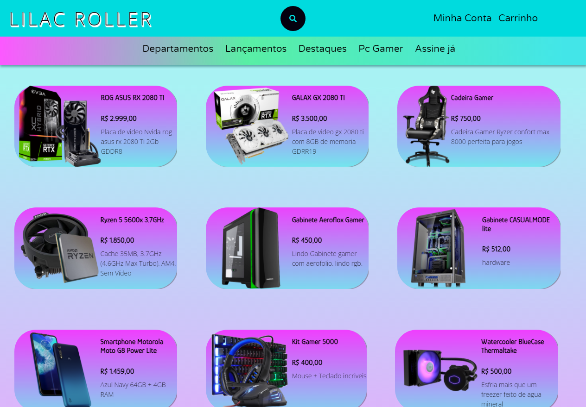

<h1 align="center">Lilac Roller</h1>
<h3>Projeto de teste desenvolvido junto a um time e orientado pelo professor Caio Couto para uma atividade do programa Educar para Trabalhar do Senac/SEC-BA</h3>

<h3> Estamos Online, check it out Lilac Roller right now!!!</h3>

 http://lilacroller.mypressonline.com/index.php

##

<h3>O nome e paleta de cores utilizada no desenvolvimento remete ao Rolieiro-de-peito-lilás
ou lilac roller que e um passarinho bem simpatico.</h3>

<h1 align="center">Preview</h1>
<h3>Ja conectado com o banco de dados mysql e configurado para as mais diversas funcões utilizando php, vale ressaltar que ainda está em dev.</h3>

<h1 align="center">Mobile em dev</h1>
<h3>Versão mobile</h3>

<h1 align="center">Preview Pagina de produtos</h1>
<h3>Pagina de produtos</h3>

